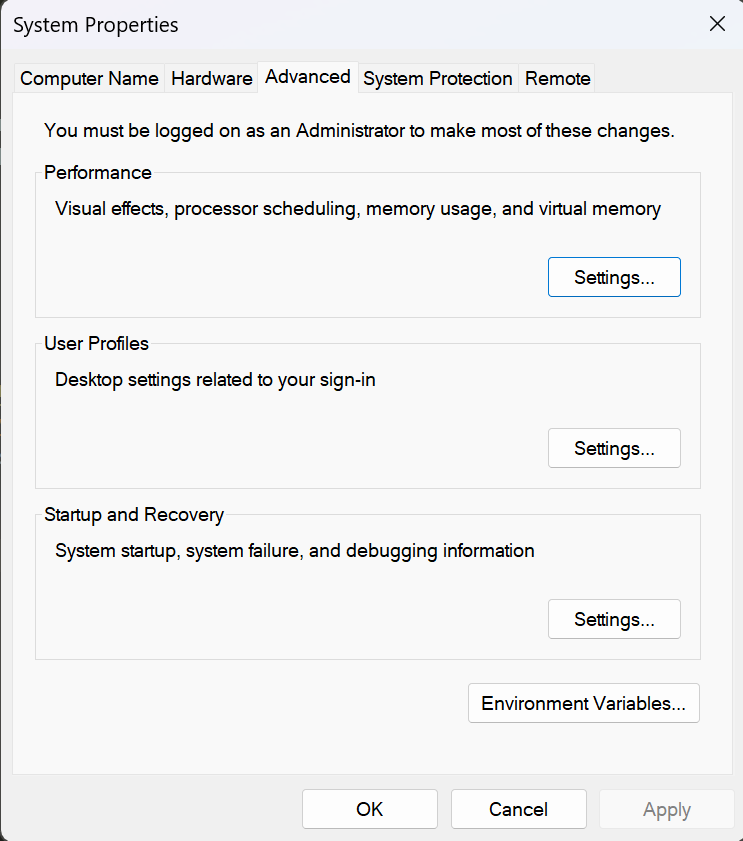

# How to use this CLI tool
This tool creates an empty file in the current working directory. Looking at the linux command `touch`.

## Table of Contents
- [Setup](#setup)
    - [Windows](#windows-setup)
- [Usage](#usage)

## Setup
For now I only support windows. Since this command is default on linux and I don't have an apple product to test it on.

### Windows Setup
To set it up on Windows you need a couple things. 
- A windows machine
- [Python 3.12.0](https://www.python.org/downloads/)

After installing python you need to create a directory somewhere on your system. You can name this directory however you want but I suggest you create a directory with the same name as the command you want it to be. For me that will be `touch`. You can make a directory with `mkdir touch` (in my case), you can replace `touch` with anything you like.

Then after that you need to put `touch.bat` and `touch.py` in this directory. Of course you can rename these files to change the command name.

After you've done that, you need to strart your [control panel](https://www.lifewire.com/open-control-panel-in-windows-11-5193187) in here you need to click `System and Security -> System` this should open the settings of your computer. In here you should find a hyperlink that says `Advanced System Settings`. Click this.

Now you're in your advanced settings tab, in here you should see something like this:
()

In here you should click the button that says: `Environment Variables`
This will open your systems variables.

In here you need to select, from the `User variables for ` and then your username, the `Path` and press the `Edit` button. Now click on the `New` button and paste the directory path inside the highlighted field.

Now you can go ahead and try it out! [usages](#usage)

## Usage
Now you've installed the CLI tool and you want to try it out.
There is only one way to use it really...
You can run the command: `touch` and see the usage. 

this: `touch filename.py` creates a file called `filename.py`
If you already have a file named `filename.py` then it should return that that file already exists.
